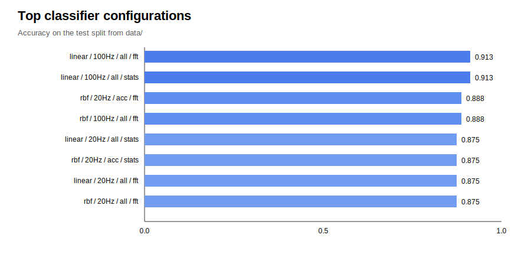
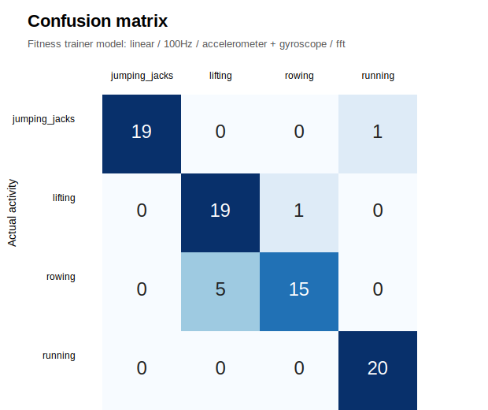

# Assignment 3

## Task 1

`gather_data.py` records data from the DIPPID device.

It records:

- accelerometer
- gyroscope
- 4 activities
- 20 Hz and 100 Hz
- hand and pocket
- 5 recordings for each setting

The data is saved in `data/`.

CSV columns:

`id,timestamp,acc_x,acc_y,acc_z,gyro_x,gyro_y,gyro_z`

## Task 2

`activity_recognizer.py` trains and tests the classifier.

It uses:

- 2 second windows
- simple statistics
- movement magnitude
- FFT features
- SVM classifier

We tested:

- `linear` and `rbf`
- `20 Hz` and `100 Hz`
- `acc`, `gyro`, and `all`
- `stats` and `stats_fft`

The results are in `evaluation_results.csv`.

The best result was:

`linear / 100Hz / all / stats_fft`

Accuracy:

`0.9125`

`fitness_trainer.py` trains this model when it starts.
It shows the target activity with pyglet and checks live DIPPID data.
